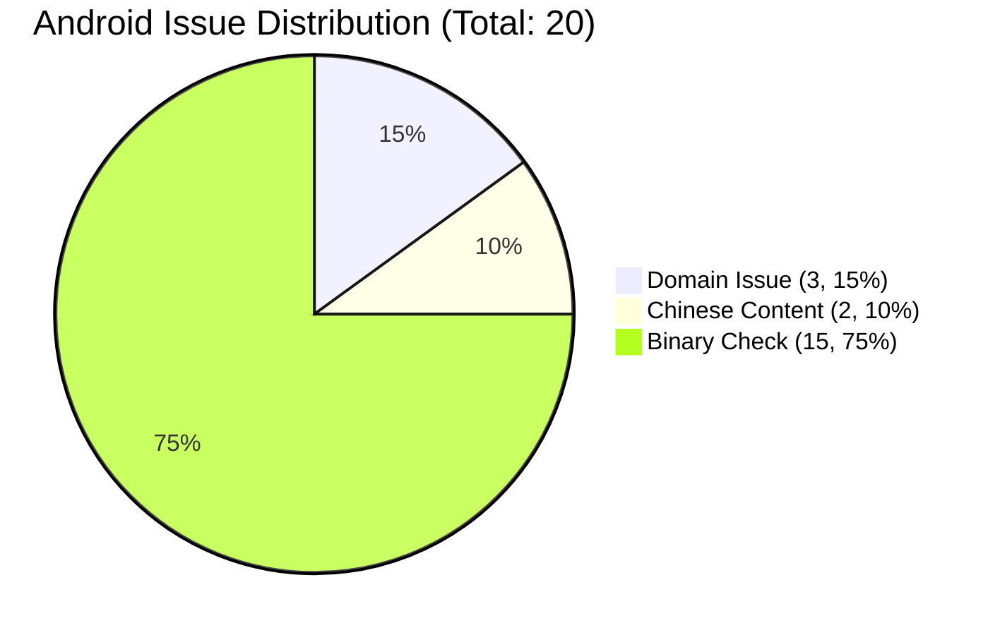
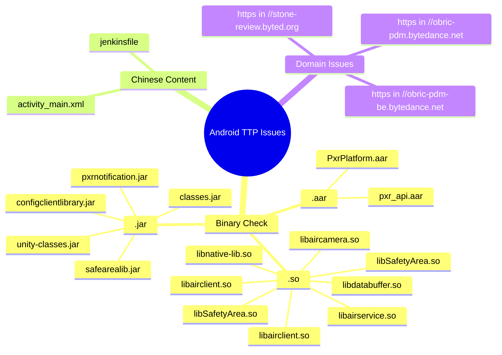

# Android TTP Compliance Overview

## Issue Distribution (Pie Chart)

```mermaid
pie title Android Issue Distribution (Total: 20)
    "Domain Issue (3, 15%)" : 3
    "Chinese Content (2, 10%)" : 2
    "Binary Check (15, 75%)" : 15
```

## Detailed Classification (Mindmap)

```mermaid
mindmap
  root((Android TTP Issues))
    Binary Check
      .aar
        pxr_api.aar
        PxrPlatform.aar
      .so
        libnative-lib.so
        libSafetyArea.so
        libaircamera.so
        libairclient.so
        libairclient.so
        libSafetyArea.so
        libairservice.so
        libdatabuffer.so
      .jar
        safearealib.jar
        pxrnotification.jar
        unity-classes.jar
        configclientlibrary.jar
        classes.jar
    Chinese Content
      activity_main.xml
      jenkinsfile
    Domain Issues
      https in //stone-review.byted.org
      https in //obric-pdm.bytedance.net
      https in //obric-pdm-be.bytedance.net
```