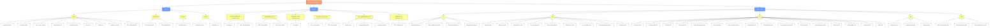

# TTP Compliance Graph TD

```mermaid
graph TD
    root[TTP Compliance Issues]:::rootClass
    classDef rootClass fill:#f96,stroke:#333,stroke-width:2px,color:white;
    classDef typeClass fill:#69f,stroke:#333,stroke-width:1px,color:white;
    classDef groupClass fill:#ff9,stroke:#333,stroke-width:1px;
    classDef itemClass fill:#fff,stroke:#333,stroke-width:1px;
    root --> cat_chinese[Chinese]:::typeClass
    cat_chinese --> grp_chinese_cs(.cs files):::groupClass
    grp_chinese_cs --> LocalizationTestEditor_cs["LocalizationTestE..."]:::itemClass
    grp_chinese_cs --> LocalizationTileTest_cs["LocalizationTileT..."]:::itemClass
    grp_chinese_cs --> PXR_Audio_Spatializer_Types_cs["PXR_Audio_Spatial..."]:::itemClass
    grp_chinese_cs --> TubeRenderer_cs["TubeRenderer.cs"]:::itemClass
    grp_chinese_cs --> LocalizationTool_cs["LocalizationTool.cs"]:::itemClass
    grp_chinese_cs --> PicoGs_cs["PicoGs.cs"]:::itemClass
    grp_chinese_cs --> PUIUtils_cs["PUIUtils.cs"]:::itemClass
    grp_chinese_cs --> PlatformConfig_cs["PlatformConfig.cs"]:::itemClass
    grp_chinese_cs --> PXR_SDKSettingEditor_cs["PXR_SDKSettingEdi..."]:::itemClass
    cat_chinese --> grp_chinese_shader(.shader files):::groupClass
    grp_chinese_shader --> PXR_Hand_shader["PXR_Hand.shader"]:::itemClass
    grp_chinese_shader --> TriangleFadeOutFromCenter_shader["TriangleFadeOutFr..."]:::itemClass
    cat_chinese --> grp_chinese_fbx(.fbx files):::groupClass
    grp_chinese_fbx --> Old_Origin_Direction_fbx["Old Origin Direct..."]:::itemClass
    cat_chinese --> grp_chinese_csv(.csv files):::groupClass
    grp_chinese_csv --> Localization_zh_csv["Localization-zh.csv"]:::itemClass
    grp_chinese_csv --> Localization_csv["Localization.csv"]:::itemClass
    root --> cat_domain[Domain]:::typeClass
    cat_domain --> grp_domain_1["developer-global.pico-interactive.com"]:::groupClass
    grp_domain_1 --> PcConfig_cs_1["PcConfig.cs"]:::itemClass
    grp_domain_1 --> PXR_SDKSettingEditor_cs_1["PXR_SDKSettingEdi..."]:::itemClass
    cat_domain --> grp_domain_2["developer.picoxr.com"]:::groupClass
    grp_domain_2 --> PXR_ProjectValidationRecommend_cs_2["PXR_ProjectValida..."]:::itemClass
    grp_domain_2 --> PXR_ProjectValidationRequired_cs_2["PXR_ProjectValida..."]:::itemClass
    cat_domain --> grp_domain_3["developer-cn.pico-interactive.com"]:::groupClass
    grp_domain_3 --> PcConfig_cs_3["PcConfig.cs"]:::itemClass
    cat_domain --> grp_domain_4["developer-cn.picoxr.com"]:::groupClass
    grp_domain_4 --> PXR_ProjectValidationRecommend_cs_4["PXR_ProjectValida..."]:::itemClass
    grp_domain_4 --> PXR_ProjectValidationRequired_cs_4["PXR_ProjectValida..."]:::itemClass
    cat_domain --> grp_domain_5["upm-registry.bytedance.net"]:::groupClass
    grp_domain_5 --> manifest_json_5["manifest.json"]:::itemClass
    grp_domain_5 --> PackageManagerSettings_asset_5["PackageManagerSet..."]:::itemClass
    grp_domain_5 --> packages_lock_json_5["packages-lock.json"]:::itemClass
    cat_domain --> grp_domain_6["developer.pico-interactive.com"]:::groupClass
    grp_domain_6 --> PXR_PlatformSettingEditor_cs_6["PXR_PlatformSetti..."]:::itemClass
    root --> cat_binary_check[Binary_check]:::typeClass
    cat_binary_check --> grp_binary_check_so(.so):::groupClass
    grp_binary_check_so --> libPicoSpatializer_so_so["libPicoSpatializer.so"]:::itemClass
    grp_binary_check_so --> libPicoAmbisonicDecoder_so_so["libPicoAmbisonicDecode..."]:::itemClass
    grp_binary_check_so --> libPicoSpatializer_so_so["libPicoSpatializer.so"]:::itemClass
    grp_binary_check_so --> libPicoAmbisonicDecoder_so_so["libPicoAmbisonicDecode..."]:::itemClass
    grp_binary_check_so --> libPicoAudioRouter_so_so["libPicoAudioRouter.so"]:::itemClass
    grp_binary_check_so --> libPicoAudioRouter_so_so["libPicoAudioRouter.so"]:::itemClass
    grp_binary_check_so --> libpxrplatformloader_so_so["libpxrplatformloader.so"]:::itemClass
    cat_binary_check --> grp_binary_check_aar(.aar):::groupClass
    grp_binary_check_aar --> pxraratom_aar_aar["pxraratom.aar"]:::itemClass
    grp_binary_check_aar --> blspace_lib_aar_aar["blspace_lib.aar"]:::itemClass
    grp_binary_check_aar --> capturelib_0_0_7_aar_aar["capturelib-0.0.7.aar"]:::itemClass
    grp_binary_check_aar --> tob_api_release_aar_aar["tob_api-release.aar"]:::itemClass
    grp_binary_check_aar --> tobservicelib_release_aar_aar["tobservicelib-release...."]:::itemClass
    grp_binary_check_aar --> BAuthLib_1_0_0_aar_aar["BAuthLib-1.0.0.aar"]:::itemClass
    grp_binary_check_aar --> pxr_api_release_aar_aar["pxr_api-release.aar"]:::itemClass
    grp_binary_check_aar --> CameraRenderingPlugin_aar_aar["CameraRenderingPlugin...."]:::itemClass
    grp_binary_check_aar --> PxrPlatform_aar_aar["PxrPlatform.aar"]:::itemClass
    cat_binary_check --> grp_binary_check_dll(.dll):::groupClass
    grp_binary_check_dll --> DOTween43_dll_dll["DOTween43.dll"]:::itemClass
    grp_binary_check_dll --> DOTweenEditor_dll_dll["DOTweenEditor.dll"]:::itemClass
    grp_binary_check_dll --> DOTween_dll_dll["DOTween.dll"]:::itemClass
    grp_binary_check_dll --> DOTween46_dll_dll["DOTween46.dll"]:::itemClass
    grp_binary_check_dll --> Jeffijoe_MessageFormat_dll_dll["Jeffijoe.MessageFormat..."]:::itemClass
    grp_binary_check_dll --> DOTween50_dll_dll["DOTween50.dll"]:::itemClass
    grp_binary_check_dll --> Microsoft_Extensions_ObjectPool_dll_dll["Microsoft.Extensions.O..."]:::itemClass
    grp_binary_check_dll --> PicoSpatializer_dll_dll["PicoSpatializer.dll"]:::itemClass
    grp_binary_check_dll --> PicoAudioRouter_dll_dll["PicoAudioRouter.dll"]:::itemClass
    grp_binary_check_dll --> PicoAmbisonicDecoder_dll_dll["PicoAmbisonicDecoder.dll"]:::itemClass
    grp_binary_check_dll --> RTCFFmpeg_dll_dll["RTCFFmpeg.dll"]:::itemClass
    grp_binary_check_dll --> libpxrplatformloader_dll_dll["libpxrplatformloader.dll"]:::itemClass
    grp_binary_check_dll --> libGLESv2_dll_dll["libGLESv2.dll"]:::itemClass
    grp_binary_check_dll --> VolcEngineRTC_dll_dll["VolcEngineRTC.dll"]:::itemClass
    grp_binary_check_dll --> openh264_4_dll_dll["openh264-4.dll"]:::itemClass
    grp_binary_check_dll --> libEGL_dll_dll["libEGL.dll"]:::itemClass
    cat_binary_check --> grp_binary_check_jar(.jar):::groupClass
    grp_binary_check_jar --> pxrnotification_jar_jar["pxrnotification.jar"]:::itemClass
    grp_binary_check_jar --> configclientlibrary_jar_jar["configclientlibrary.jar"]:::itemClass
    grp_binary_check_jar --> safearealib_jar_jar["safearealib.jar"]:::itemClass
    cat_binary_check --> grp_binary_check_dylib(.dylib):::groupClass
    grp_binary_check_dylib --> libPicoAudioRouter_dylib_dylib["libPicoAudioRouter.dylib"]:::itemClass
    grp_binary_check_dylib --> libPicoSpatializer_dylib_dylib["libPicoSpatializer.dylib"]:::itemClass
    grp_binary_check_dylib --> libPicoAmbisonicDecoder_dylib_dylib["libPicoAmbisonicDecode..."]:::itemClass
```