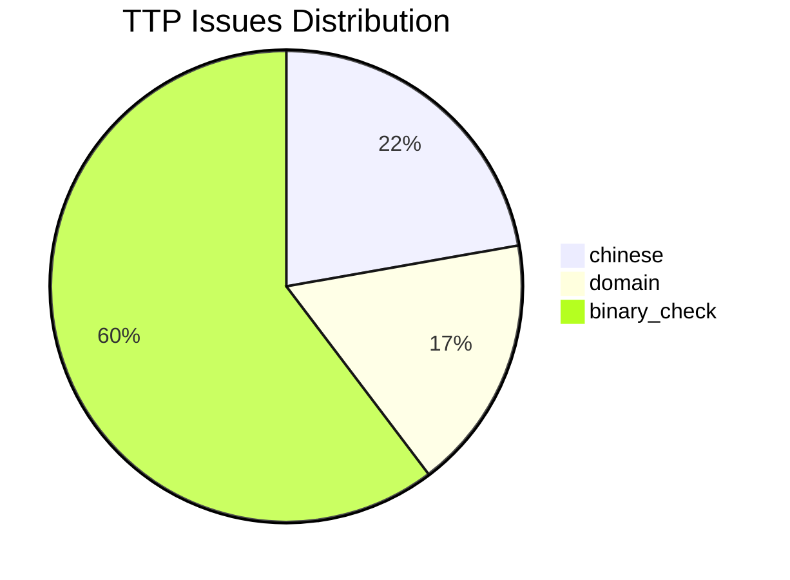
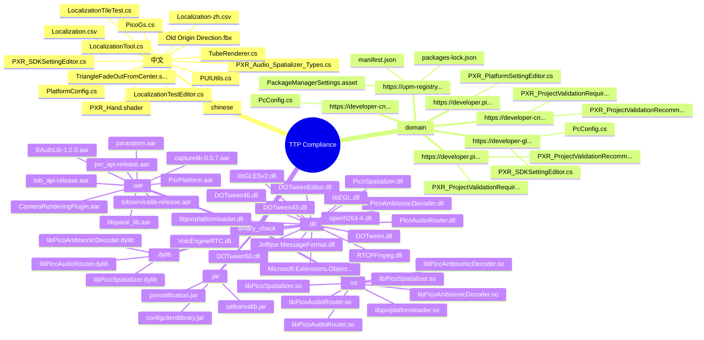

# TTP Compliance Visualizations

```mermaid
pie
    title TTP Issues Distribution
    "chinese" : 14
    "domain" : 11
    "binary_check" : 38
```

```mermaid
mindmap
  root((TTP Compliance))
    chinese
      中文
        LocalizationTestEditor.cs
        LocalizationTileTest.cs
        PXR_Audio_Spatializer_Types.cs
        TubeRenderer.cs
        LocalizationTool.cs
        PXR_Hand.shader
        TriangleFadeOutFromCenter.s...
        Old Origin Direction.fbx
        PicoGs.cs
        PUIUtils.cs
        PlatformConfig.cs
        PXR_SDKSettingEditor.cs
        Localization-zh.csv
        Localization.csv
    domain
      https://developer-gl...
        PcConfig.cs
        PXR_SDKSettingEditor.cs
      https://developer.pi...
        PXR_ProjectValidationRecomm...
        PXR_ProjectValidationRequir...
      https://developer-cn...
        PcConfig.cs
      https://developer-cn...
        PXR_ProjectValidationRecomm...
        PXR_ProjectValidationRequir...
      https://upm-registry...
        manifest.json
        PackageManagerSettings.asset
        packages-lock.json
      https://developer.pi...
        PXR_PlatformSettingEditor.cs
    binary_check
      .so
        libPicoSpatializer.so
        libPicoAmbisonicDecoder.so
        libPicoSpatializer.so
        libPicoAmbisonicDecoder.so
        libPicoAudioRouter.so
        libPicoAudioRouter.so
        libpxrplatformloader.so
      .aar
        pxraratom.aar
        blspace_lib.aar
        capturelib-0.0.7.aar
        tob_api-release.aar
        tobservicelib-release.aar
        BAuthLib-1.0.0.aar
        pxr_api-release.aar
        CameraRenderingPlugin.aar
        PxrPlatform.aar
      .dll
        DOTween43.dll
        DOTweenEditor.dll
        DOTween.dll
        DOTween46.dll
        Jeffijoe.MessageFormat.dll
        DOTween50.dll
        Microsoft.Extensions.Object...
        PicoSpatializer.dll
        PicoAudioRouter.dll
        PicoAmbisonicDecoder.dll
        RTCFFmpeg.dll
        libpxrplatformloader.dll
        libGLESv2.dll
        VolcEngineRTC.dll
        openh264-4.dll
        libEGL.dll
      .jar
        pxrnotification.jar
        configclientlibrary.jar
        safearealib.jar
      .dylib
        libPicoAudioRouter.dylib
        libPicoSpatializer.dylib
        libPicoAmbisonicDecoder.dylib
```
