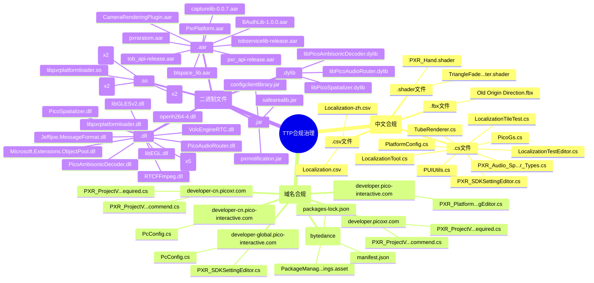

# TTP Compliance Mindmap Optimized

```mermaid
mindmap
  root((TTP合规治理))
    Chinese(中文合规)
      .cs文件
        LocalizationTestEditor.cs
        LocalizationTileTest.cs
        PXR_Audio_Sp...r_Types.cs
        TubeRenderer.cs
        LocalizationTool.cs
        PicoGs.cs
        PUIUtils.cs
        PlatformConfig.cs
        PXR_SDKSettingEditor.cs
      .shader文件
        PXR_Hand.shader
        TriangleFade...ter.shader
      .fbx文件
        Old Origin Direction.fbx
      .csv文件
        Localization-zh.csv
        Localization.csv
    Domain(域名合规)
      developer-global.pico-interactive.com
        PcConfig.cs
        PXR_SDKSettingEditor.cs
      developer.picoxr.com
        PXR_ProjectV...commend.cs
        PXR_ProjectV...equired.cs
      developer-cn.pico-interactive.com
        PcConfig.cs
      developer-cn.picoxr.com
        PXR_ProjectV...commend.cs
        PXR_ProjectV...equired.cs
      内网源(bytedance)
        manifest.json
        PackageManag...ings.asset
        packages-lock.json
      developer.pico-interactive.com
        PXR_Platform...gEditor.cs
    Binary(二进制文件)
      .so
        libPicoSpatializer.so (x2)
        libPicoAmbisonicDecoder.so (x2)
        libPicoAudioRouter.so (x2)
        libpxrplatformloader.so
      .aar
        pxraratom.aar
        blspace_lib.aar
        capturelib-0.0.7.aar
        tob_api-release.aar
        tobservicelib-release.aar
        BAuthLib-1.0.0.aar
        pxr_api-release.aar
        CameraRenderingPlugin.aar
        PxrPlatform.aar
      .dll
        DOTween相关.dll (x5)
        Jeffijoe.MessageFormat.dll
        Microsoft.Extensions.ObjectPool.dll
        PicoSpatializer.dll
        PicoAudioRouter.dll
        PicoAmbisonicDecoder.dll
        RTCFFmpeg.dll
        libpxrplatformloader.dll
        libGLESv2.dll
        VolcEngineRTC.dll
        openh264-4.dll
        libEGL.dll
      .jar
        pxrnotification.jar
        configclientlibrary.jar
        safearealib.jar
      .dylib
        libPicoAudioRouter.dylib
        libPicoSpatializer.dylib
        libPicoAmbisonicDecoder.dylib
```