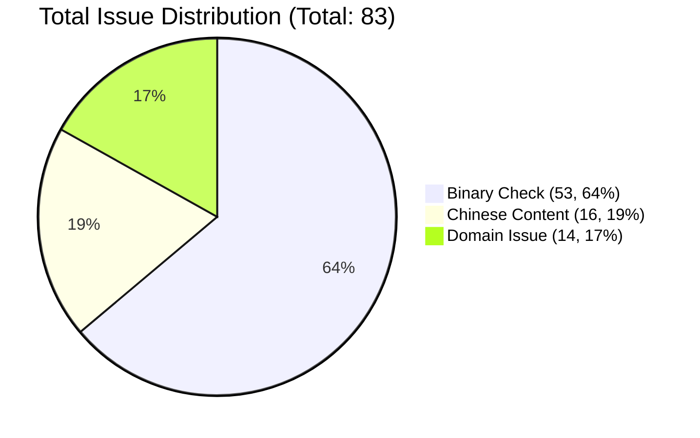

# TTP Compliance Issue Distribution

### Distribution Details
- **Binary Check**: 53 items (64%) - Includes external dependencies like PICO SDK, DOTween, etc.
- **Chinese Content**: 16 items (19%) - Source code comments, UI text, etc.
- **Domain Issue**: 14 items (17%) - Non-compliant URLs in configuration or code.
