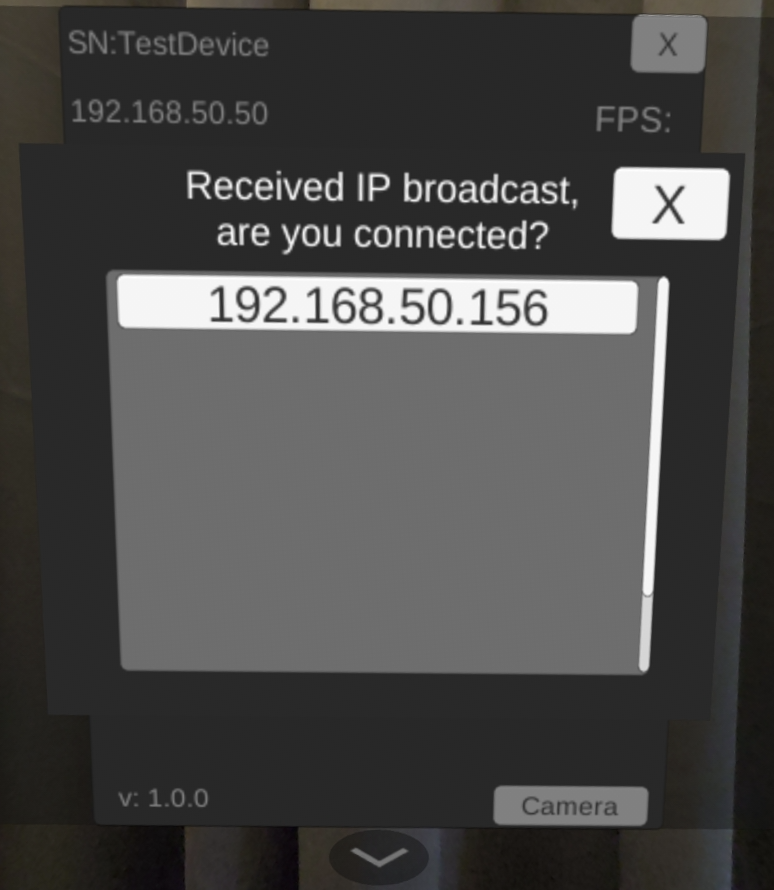
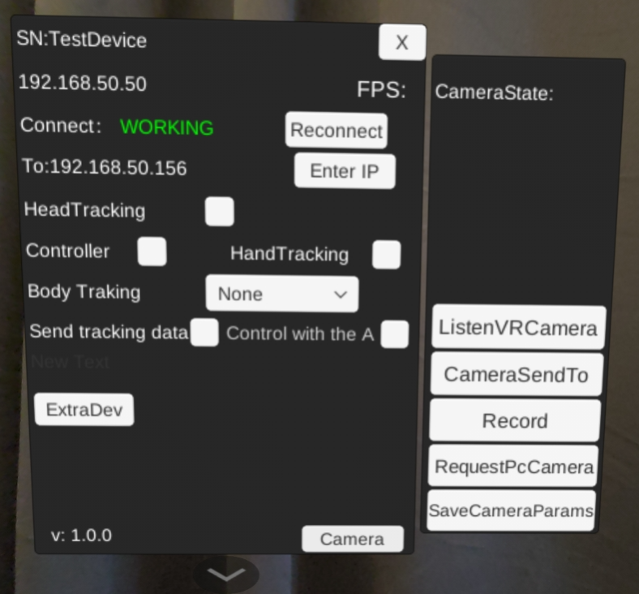
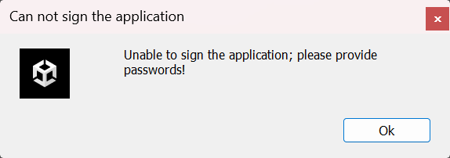
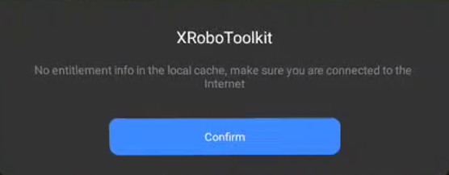

# XRoboToolkit-Unity-Client Project Documentation

## Project Overview
`XRoboToolkit-Unity-Client` is a Unity-based software developed for PICO devices to facilitate robot training and remote teleoperation. It works in conjunction with PC-side software to achieve robot training and teleoperation functionalities.

## Unity UI Main Panel Reference

| Item | Description |
|------|-------------|
| SN | Display Serial number of the XR device, only functional with Pico 4 Ultra enterprise version |
| Client IP | IP address of the XR device |
| Connect | Connection status between robot and XR device |
| Server IP | IP address of the robot PC |
| Head Tracking | Toggle On/Off to send out head 6 DoF pose |
| Controller | Toggle On/Off to parse VR controller's 6 DoF pose and button status in data stream |
| HandTracking | Toggle On/Off to parse hand tracking data in data stream |
| BodyTracking | Dropdown menu to select None, full body tracking (require Pico tracker) to parse in data stream |
| Send Tracking Data | Toggle On/Off to sync above selected poses between XR device and robot PC |
| Control with the A | Toggle On/Off to rapid pause or resume sync with controller button A |
| FPS | Data syncing frames per second |
| ListenVRCamera | Open a connection and wait for camera feed from another headset (used on human operator side) |
| CameraSendTo | Send out camera feed from the VR headset (used when the VR headset serves as robot eyes) |
| RequestPCCamera | Open a connection and wait for camera feed from a PC camera (Used when a PC stereo camera serves as robot eyes) |
| SaveCameraParams | Save camera intrinsics and extrinsics in local path |

## Feature list
- **Pose sync between XR device and robot PC**
  Transmits pose data from the XR headset to the robot-side PC for robot teleoperation.
- **Local pose and stereo vision data collection**
  Synchronously records stereo vision and pose data collected from the XR headset, stored in the device's `/Download` directory.
- **Remote stereo vision sync between two XR headsets**
  Transmits stereo vision from the robot-side headset to operator-side for 3D display.
- **Remote stereo vision sync between PC camera and XR headset**
  Transmits stereo vision from the robot-side PC camera to operator-side headset for 3D display.
## Feature instructions

### Pose sync between XR device and robot PC
1. Connect robot PC and Pico 4 Ultra under the same network
2. On robot PC, run service:
   - **Windows**: Run `\Program Files (x86)\roboticsservice\runService.bat`
   - **Linux (Ubuntu/Debian x86)**: Run `/opt/apps/roboticsservice/runService.sh`
3. Open app XR-Robotics-Toolkit-Unity-Sample on Pico 4 Ultra

If the PC service is running successfully, when you open the app on Pico headset, you will receive a prompt window for server connection. Point to the IP address and click it with the trigger button on the controller.

<div align="center">
  
</div>

The main panel will display "Working" if connection is established.

<div align="center">
  
</div>

On the main panel, select preferred pose information to be synced, such as head tracking, controller tracking, or body tracking. If your headset and PC have established connection, then the pose data will be synced to PC when "Send Tracking Data" is toggled On. When "Control with A" option toggles On, you may also use "A" button on the right controller to toggle "Send Tracking Data" On or Off during data syncing.

### Local pose and stereo vision data collection

**Note:** At this moment, camera data collection still requires special approval through Pico's enterprise service.

On the main panel, select preferred pose data to be collected, click camera button, and then click Record. You will see a brief blur effect on the screen, record button will turn red, and camera status will turn to 6. When you finish recording, press recording button again to end the collection session. The video files and pose files will be saved on your local headset. You may also click "SaveCameraParams" to save camera intrinsics and extrinsics for the local headset.

### Remote stereo vision sync between two XR headsets

1. Connect both XR headsets to the same network
2. Make sure that the camera to be used as the camera source has VST camera permission (requires special approval)
3. Open XR-Robotics-Toolkit-Unity-Sample on both devices

In the display headset (headset 1), remember the IP displayed in the main panel, then click camera button on the bottom right, and hit ListenVRCamera. You will then see a floating big blank screen.

After seeing the blank screen, go to the camera headset (headset 2), click camera button, and then click CameraSendTo. On the pop-up screen, input IP address of the display headset. Then you will see a brief blur effect on the screen, and camera status turns to 6.

You should now be able to see the live camera feed of headset 2 on headset 1. Press B button on the right controller of headset 1 to switch between side-by-side views and stereo-3D views.

### Remote stereo vision sync between PC camera and XR headset
Soon to be updated.


## Directory Structure

### Assets
Core resource folder containing all project assets:
- **InteractionTools**
  XR interaction scripts and 3D models.
- **Plugins**
  Android interface implementations including `robotassistant_lib.aar` and Android platform configurations.
- **Resources**
  Project-specific assets.
- **Scripts**
  Core application logic:
  - **Camera**
    Camera-related functionality.
  - **ExtraDev**
    PICO tracker peripheral integration.
  - **Network**
    Network communication implementation.
  - **UI**
    User interface components.

### robotassistant_lib.aar
Android library containing PICO device interfaces and image processing logic.

### Key Classes
- **UIOperater**
  UI interaction logic.
- **UICameraCtrl**
  Camera control implementation.
- **TcpHandler**
  Network data transmission handler.
- **TrackingData**
  Pose data processing module.

### Packages
Managed via Unity Package Manager.

### ProjectSettings
Unity project configuration files:
- Audio/Physics/Input settings
- Quality/Graphics configurations

## PICO Unity Integration SDK
Official SDK for PICO device integration:
[Download Link](https://developer.picoxr.com/en/resources/)

## Project Configuration

### Environment Requirements
- Unity 2022.3.16f1+
- Android Studio 4.2.2+
- Android SDK 29
- Android NDK 21.4.7075529
- PICO Unity SDK 1.1.0 (Recommended)

⚠️ **Important Notes**:
1. Use exact Unity version 2022.3.16f1 to avoid compatibility issues
2. Verify Android SDK/NDK paths in Unity Preferences
3. Ensure PICO SDK compatibility with Unity version
4. Complete Android module installation during Unity setup

### APK Build Process
1. Set platform to Android:
  - File → Build Settings → Android → Switch Platform
2. Configure signing:
  - Player Settings → Publishing Settings
  - Create new Keystore via Keystore Manager for first build
3. Build execution:
  - File → Build Settings → Build (macOS)
  - Output path: `ProjectRoot/ProjectSettings/Android/`

## One-Click Build System

### Activation
- **Hotkeys**:
  - Windows: `Ctrl + Shift + B`
  - macOS: `Cmd + Shift + B`
- **Menu Path**:
  Build → One - click packaging

### Version Management
Auto-increments version number (Format: `Major.Minor.Build`):
- Example: 1.0.0 → 1.0.1 → ... → 1.1.0

### Output Structure
```
ProjectRoot/
└── Builds/
    ├── Android/
    ├── iOS/
    ├── macOS/
    └── Windows/
```

### Post-Build Actions
- **Windows**:
  Automatically opens File Explorer with output file selected
- **macOS**:
  Reveals build output in Finder
- **Universal**:
  Displays build result dialog

### Core Interfaces
- **Hardware Interaction Layer**
  - PICO Enterprise API Calls (Requires Device Permissions)
    ```csharp
    PXR_Enterprise.SwitchSystemFunction(SystemFunctionSwitchEnum.SFS_SECURITY_ZONE_PERMANENTLY, SwitchEnum.S_OFF);
    PXR_Enterprise.OpenVSTCamera(); // Enable VST Passthrough Camera
    ```

- **Image Processing Pipeline**
  - Android Native Decoder Bridge
    ```csharp
    private static AndroidJavaObject _javaObj = new AndroidJavaObject("com.picovr.robotassistantlib.MediaDecoder");
    public static void initialize(int unityTextureId, int width, int height) {
        GetJavaObject().Call("initialize", unityTextureId, width, height);
    }
    ```

- **Network Transport Layer**
  - Asynchronous UDP Data Reception
    ```csharp
    UdpClient client = new UdpClient(port);
    BeginReceive();
    void BeginReceive() {
        client.BeginReceive(ReceiveCallback, null);
    }
    void ReceiveCallback(IAsyncResult ar) {
        IPEndPoint remoteEP = null;
        byte[] data = client.EndReceive(ar, ref remoteEP);
        // Data parsing...
    }
    ```

- **Data Synchronization Mechanism**
  - `TcpHandler → NetPacket`: Data packet encapsulation
  - `NetPacket → ByteBuffer`: Serialization processing
  - `ByteBuffer → Socket`: Asynchronous transmission
  - `Socket → TcpHandler`: Callback handling

- **Unity Business Logic**
  - IP Address Validation
    ```csharp
    if (!IPAddress.TryParse(ip, out _)) {
        SetRemind(LogType.Error, "The IP format is incorrect!");
        return;
    }
    TcpHandler.Connect(ip); // Trigger TCP connection
    ```

---

### Architecture Overview
- **Cross-Platform Hybrid Architecture**:
  Unity C# layer and Android Java layer communicate via JNI bridge for hardware-accelerated encoding/decoding.

- **Dual Data Channels**:
  - Video Stream: 60 FPS with adaptive QoS
  - Pose Data Channel: 90Hz with low-latency priority

- **Thread Model**:
  | Thread Type          | Responsibilities                          |
  |----------------------|-------------------------------------------|
  | Main Thread          | UI rendering & user input handling       |
  | Worker Thread        | Video encoding/network transmission       |
  | GL Thread            | OpenGL ES texture operations              |

- **Memory Management**:
  Uses ring buffer for video frames to prevent GC stutter.

- **Fault Recovery**:
  - Automatic TCP reconnection
  - Keyframe retransmission support for video decoding

- **Key Performance Metrics**:
  | Metric                     | Value                        |
  |----------------------------|------------------------------|
  | End-to-End Latency          | ~100ms (720P *2 @60FPS)          |
  | Pose Data Packet Size       | 56 bytes/frame               |
  | Video Encoding Bitrate      | 5 Mbps                      |
  | Network Fault Tolerance     | 3 retries + FEC              |

---

### Q&A

- Q: Can not sign the application



A: Please refer to this [link](https://developer-cn.picoxr.com/en/document/unity/number-of-apks-associated-with-a-key-exceeds-limit/) for the solution.

- Q: No entitlement info ......



A: Connect the headset to public internet and run it.

- Q: Failed to connect on Linux.

A: Ensure the PC and headset are in the same WiFi network. Run the 3D application first and then run the Headset App.

---

For technical support or documentation updates, contact the development team.
