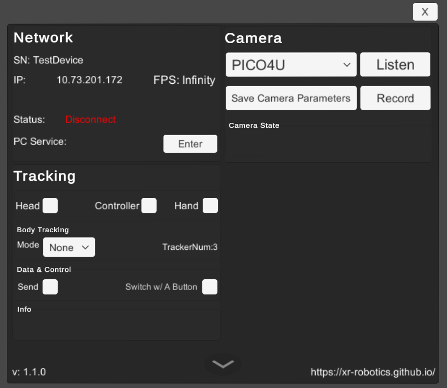
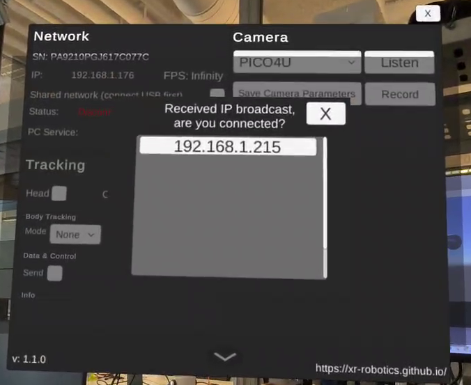
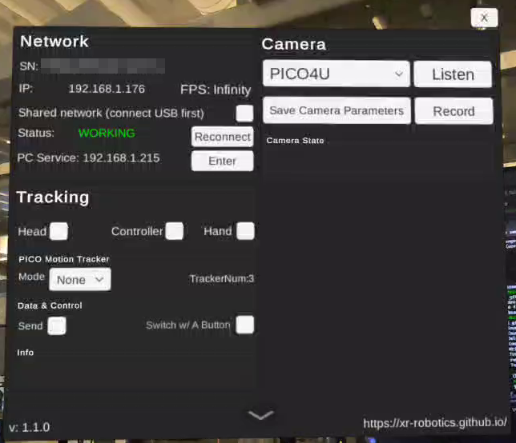
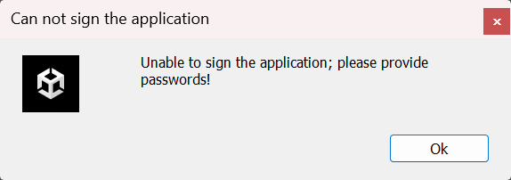
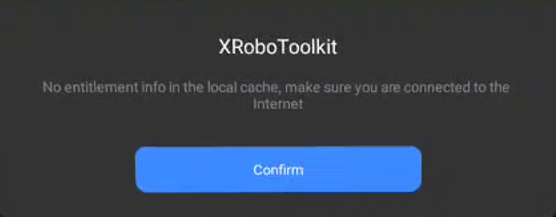

# XRoboToolkit-Unity-Client Project Documentation

## Project Overview
`XRoboToolkit-Unity-Client` is a Unity-based software developed for PICO devices to facilitate robot training and remote teleoperation. It works in conjunction with PC-side software to achieve robot training and teleoperation functionalities.

## Unity UI Main Panel Reference



| Item                                           | Description                                                                                     |
|------------------------------------------------|-------------------------------------------------------------------------------------------------|
| Network - SN                                   | Display Serial number of the XR device, only functional with Pico 4 Ultra enterprise version    |
| Network - IP                                   | IP address of the XR device                                                                     |
| Network - FPS                                  | Data syncing frames per second                                                                  |
| Network - Status                               | Connection status between robot and XR device                                                   |
| Network - PC Service                           | IP address of the PC running PC service                                                         |
| Network - Enter                                | Manually input the PC service's IP                                                              |
| Tracking - Head                                | Toggle On/Off to send out head 6 DoF pose                                                       |
| Tracking - Controller                          | Toggle On/Off to parse VR controller's 6 DoF pose and button status in data stream              |
| Tracking - Hand                                | Toggle On/Off to parse hand tracking data in data stream                                        |
| Tracking - PICO Motion Tracker - Mode          | Dropdown menu to select None, full body tracking (require Pico tracker) to parse in data stream |
| Tracking - PICO Motion Tracker - TrackerNum    | Number of the trackers                                                                          |
| Tracking - Data & Control - Send               | Toggle On/Off to sync above selected poses between XR device and robot PC                       |
| Tracking - Data & Control - Switch w/ A Button | Toggle On/Off to rapid pause or resume sync with  the right-hand controller button A            |
| Tracking - Status                              | Panel to show tracking related information                                                      |
| Remote Vision - State                          | Show the state of camera                                                                        |
| Remote Vision - Dropdown (Video Source)        | Select a supported video source                                                                 |
| Remote Vision - Listen                         | Open video plus full-duplex raw PCM audio when the PC/operator bridge exposes it          |
| Data Collection - Tracking                     | Whether to record pose tracking data                                                            |
| Data Collection - Vision                       | Whether to record vision data                                                                   |
| Data Collection - Record                       | Start/Stop recording                                                                            |
| Log                                            | Show logs                                                                                       |

## Feature list
- **Pose sync between XR device and robot PC**
  Transmits pose data from the XR headset to the robot-side PC for robot teleoperation.
- **Local pose and stereo vision data collection**
  Synchronously records stereo vision and pose data collected from the XR headset, stored in the device's `/Download` directory.
- **Remote stereo vision sync between two XR headsets**
  Transmits stereo vision from the robot-side headset to operator-side for 3D display.
- **Remote stereo vision sync between PC camera and XR headset**
  Transmits stereo vision from the robot-side PC camera to operator-side headset for 3D display.
- **Remote robot microphone audio playback**
  Connects to the PC/operator bridge raw PCM audio port and plays robot-side microphone audio in the headset while remote vision is open.
- **Pico microphone audio uplink**
  Captures the headset microphone and sends bounded-latency 20 ms PCM frames to the operator bridge.
## Feature instructions

### Pose sync between XR device and robot PC
1. Connect robot PC and Pico 4 Ultra under the same network
2. On robot PC, run service:
   - **Windows**: Run `\Program Files (x86)\roboticsservice\runService.bat`
   - **Linux (Ubuntu/Debian x86)**: Run `/opt/apps/roboticsservice/runService.sh`
3. Open app XRoboToolkit on Pico 4 Ultra

If the PC service is running successfully, when you open the app on Pico headset, you will receive a prompt window for server connection. Point to the IP address and click it with the trigger button on the controller.

<div align="center">
  
</div>

The main panel will display "WORKING" if connection is established.

<div align="center">
  
</div>

On the main panel, select preferred pose information to be synced, such as head tracking, controller tracking, or body tracking. If your headset and PC have established connection, then the pose data will be synced to PC when "Send" is toggled On. When "Switch w/ A Button" option toggles On, you may also use "A" button on the right controller to toggle "Send" On or Off during data syncing.

### Local pose and stereo vision data collection

**Note:** At this moment, camera data collection still requires special approval through Pico's enterprise service.

On the main panel, select preferred pose data to be collected, click Record. You will see a brief blur effect on the screen, record button will turn red, and camera status will turn to 6. When you finish recording, press recording button again to end the collection session. The video files and pose files will be saved on your local headset. You may also click "Save Camera Parameters" to save camera intrinsic and extrinsic parameters for the local headset.

### Remote stereo vision sync between two XR headsets

1. Connect both XR headsets to the same network.
2. Make sure that the camera to be used as the camera source has VST camera permission (requires special approval).
3. Open **XRRoboToolkit** on both headsets.
> **Note:** The headset serving as robot eyes (H1) should have the camera permission enabled, while the other headset (H2) is for the human operator side.
4. H1: Remember the IP of the VR headset and **DON'T DO ANYTHING**.
5. H2: On the Camera panel, Select **PICO4U** as the video source, Click Listen, input H1's IP, and click Confirm.
6. H2: You should now be able to see the live camera. Press B button on the right-hand controller to switch between side-by-side views and stereo-3D views.
7. H2: If you close the live camera window, you can simply repeat Step 5.
8. If you want to stop the camera streaming, quit **XRRoboToolkit** on H1 and H2.

### Remote stereo vision sync between ZED camera (Orin) and XR headset

1. Clone [XRoboToolkit-Orin-Video-Sender](https://github.com/XR-Robotics/XRoboToolkit-Orin-Video-Sender.git) on Orin.
2. Build 
3. Run the following command on Orin:
   ```bash
   ./OrinVideoSender --listen <IP of Orin>:13579
   ```
4. Open **XRRoboToolkit** on the XR headset.
5. On the Camera panel, select "ZEDMINI" as the video source.
6. Click "Listen", input the IP of Orin, and click Confirm.
7. You should now be able to see the live camera. Press B button on the right-hand controller to switch between side-by-side views and stereo-3D views.
8. If you close the live camera window, you can simply repeat Step 6.
9. If you want to stop the camera streaming, quit **XRRoboToolkit** on the XR headset and stop the OrinVideoSender on Orin.

### Full-duplex audio with the operator bridge

When the G1-Wuji operator stack is started with audio enabled, the operator-side
headset bridge exposes the relayed G1 built-in microphone as raw `s16le`
`16 kHz` mono PCM on TCP port `13580` by default. The headset uses the same IP
entered for Remote Vision and automatically starts audio playback after Listen
is confirmed. Closing the remote camera window stops both the video stream and
the audio client.

At the same time, `PicoMicrophoneStreamer` captures the headset microphone,
downmixes/resamples it to `s16le` `16 kHz` mono, and sends timestamped 20 ms
frames to the operator bridge. The uplink is not an anonymous raw PCM socket:
it is enabled only after the current Remote Vision control connection sends an
`AUDIO_SESSION` request and receives a matching, one-session token. Android
`RECORD_AUDIO` permission is requested at runtime; denying it disables only the
microphone uplink and does not block the camera or robot teleoperation UI.

The downlink fallback can be changed per video source through `AudioStreamPort`.
The microphone port is intentionally not taken from static configuration: it
must arrive in an authenticated `AUDIO_CONFIG` message using schema
`g1_wuji_audio_ports_v2`. The current Inspire profile negotiates `13680/13681`.

The payload of the framed `AUDIO_CONFIG` command is:

```json
{
  "schema": "g1_wuji_audio_ports_v2",
  "audio_request_id": "<matching-32-char-request-id>",
  "audio_stream_port": 13680,
  "microphone_upload_port": 13681,
  "microphone_upload_protocol": "g1_wuji_audio_uplink_v1",
  "microphone_upload_token": "<ephemeral-session-token>",
  "sample_rate": 16000,
  "channels": 1,
  "sample_format": "s16le",
  "video_projection": "flat",
  "video_stereo_layout": "mono"
}
```

The upload TCP stream begins with a length-framed `G1AT` authentication record.
Audio uses `G1AF` records containing a sequence number, capture timestamp, and
exactly 640 bytes of PCM; an idle/muted client sends `G1AH` heartbeats. The
operator drops wrong-peer, wrong-token, malformed, out-of-order, and stale
records before cloud relay. The token is never written to the status file.
Remote Vision control itself uses the managed `OperatorControlClient`, whose
read-exact framing and per-run socket ownership avoid the vendor AAR client's
partial-length-read and rapid-reconnect races.

The microphone uplink is full-duplex by default. Calling
`UICameraCtrl.SetMicrophoneMuted(true)` keeps local capture running but sends no
PCM frames, so robot-side playback/ducking does not remain falsely active.

### Connection address persistence

- Data & Control remembers the last valid IPv4 confirmed for PC Service.
- Remote Vision stores a separate operator IP for each video source and restores
  the last successfully confirmed source. Lookup order is current-source address,
  global last address, then the valid legacy address.
- Input is trimmed and strictly validated. Only an explicit Connect/Confirm flushes
  the value with `PlayerPrefs.Save()`; invalid input keeps the dialog open and does
  not overwrite a saved address.
- The app stores only addresses and the video-source name. It never persists ports,
  audio session tokens, or an automatic-connect instruction.

`adb install -r` preserves these preferences only when package id and signing key
remain unchanged. Uninstalling the app or running `pm clear` removes them. The
release package `com.xrobotoolkit.client` and beta package
`com.xrobotoolkit.client.voicebeta` have separate storage and do not migrate values
between each other.

### Flat and panoramic remote video

The operator bridge can advertise `video_projection=flat|equirectangular` and
`video_stereo_layout=mono|side_by_side|top_bottom` in the same negotiated
configuration. Missing or unknown values fall back to `flat/mono`, preserving
the existing floating-screen behavior. `equirectangular` binds the received
texture to Unity's `Skybox/Panoramic`, suspends both legacy eye canvases, hides
the flat `RawImage`, and restores the previous skybox/camera/UI state when
Listen stops.

The app does not stitch a panorama. Use `equirectangular` only when the source
is a real panorama: 2:1 for mono, normally 4:1 overall for two side-by-side 2:1
eyes, or normally 1:1 overall for two top-bottom 2:1 eyes. Current ordinary G1
camera streams must stay `flat`; the explicit contract is also intended for a
future simulation panorama producer. The operator/G1 producer configuration
must use matching dimensions (for example `1280x640` for mono); panoramic
source/output ratios are rejected before resize rather than stretched.
Select the matching built-in Remote Vision source (`PANORAMA_MONO_1280x640`,
`PANORAMA_SBS_2560x640`, or `PANORAMA_TOP_BOTTOM_1280x1280`) before Listen.

Run this from the `g1_wuji_teleoperation` operator repository:

```bash
scripts/run_operator_cloud_stack.sh --cleanup-first --with-camera --with-audio --auto-start
```

### Pico Crash Diagnostics

The app writes local crash breadcrumbs under
`Application.persistentDataPath/g1_wuji_crash_probe/`:

- `breadcrumbs.jsonl`: startup, lifecycle, Listen, `AUDIO_CONFIG`, duplex audio,
  panorama, warnings, errors, and exceptions.
- `active_session.json`: the current session sentinel. A clean
  `OnApplicationQuit` marks `clean_exit=true`; the next launch detects a missing
  clean exit and writes `last_exit.json`.
- `last_exit.json`: previous unclean exit marker.

Export a Pico debugging bundle from the workstation:

```bash
scripts/pico/export_crash_probe.sh /tmp/pico-crash-$(date +%Y%m%d-%H%M%S)
```

The script captures the app probe files, `adb logcat -d`, device metadata, and
any accessible tombstone/ANR/Dropbox clues. Non-root Pico firmware usually
blocks direct `/data/tombstones` and `/data/anr` reads, so use
`breadcrumbs.jsonl`, `last_exit.json`, and `logcat_threadtime.txt` as the first
debugging surface. The script auto-detects an installed beta package first; set
`PICO_APP_PACKAGE=...` to override the package id explicitly.


## Directory Structure

### Assets
Core resource folder containing all project assets:
- **InteractionTools**
  XR interaction scripts and 3D models.
- **Plugins**
  Android interface implementations including `robotassistant_lib-i18n-release.aar` and Android platform configurations.
- **Resources**
  Project-specific assets.
- **Scripts**
  Core application logic:
  - **Camera**
    Camera-related functionality.
  - **ExtraDev**
    PICO tracker peripheral integration.
  - **Network**
    Network communication implementation.
  - **Audio**
    Remote robot-microphone playback and Pico microphone PCM upload clients.
  - **UI**
    User interface components.

### robotassistant_lib-i18n-release.aar
Android library containing PICO device interfaces and image processing logic.

### Key Classes
- **UIOperater**
  UI interaction logic.
- **UICameraCtrl**
  Camera control implementation.
- **TcpHandler**
  Network data transmission handler.
- **TrackingData**
  Pose data processing module.

### Packages
Managed via Unity Package Manager.

### ProjectSettings
Unity project configuration files:
- Audio/Physics/Input settings
- Quality/Graphics configurations

## PICO Unity Integration SDK
Official SDK for PICO device integration:
[Download Link](https://developer.picoxr.com/en/resources/)

## Project Configuration

### Environment Requirements
- Unity 2022.3.16f1+
- Android Studio 4.2.2+
- Android SDK 29
- Android NDK 21.4.7075529
- PICO Integration SDK (com.unity.xr.picoxr) 3.1.2

⚠️ **Important Notes**:
1. Use exact Unity version 2022.3.16f1 to avoid compatibility issues
2. Verify Android SDK/NDK paths in Unity Preferences
3. Ensure PICO SDK compatibility with Unity version
4. Complete Android module installation during Unity setup

### APK Build Process
1. Set platform to Android:
  - File → Build Settings → Android → Switch Platform
2. Configure signing:
  - Player Settings → Publishing Settings
  - Create new Keystore via Keystore Manager for first build
3. Build execution:
  - File → Build Settings → Build (macOS)
  - Output path: `ProjectRoot/ProjectSettings/Android/`

## One-Click Build System

### Activation
- **Hotkeys**:
  - Windows: `Ctrl + Shift + B`
  - macOS: `Cmd + Shift + B`
- **Menu Path**:
  Build → One - click packaging

### Version Management
Auto-increments version number (Format: `Major.Minor.Build`):
- Example: 1.0.0 → 1.0.1 → ... → 1.1.0

### Output Structure
```
ProjectRoot/
└── Builds/
    ├── Android/
    ├── iOS/
    ├── macOS/
    └── Windows/
```

### Post-Build Actions
- **Windows**:
  Automatically opens File Explorer with output file selected
- **macOS**:
  Reveals build output in Finder
- **Universal**:
  Displays build result dialog

### Voice Duplex Beta Build

For headset testing without replacing the currently installed release app, build the
side-by-side beta package. It uses application id
`com.xrobotoolkit.client.voicebeta`, ARM64 + IL2CPP, Android API 30/31, and Unity's
development signing key. It does not use or modify the production keystore.

```bash
/path/to/Unity \
  -batchmode -nographics -quit \
  -projectPath /path/to/XRoboToolkit-Unity-Client \
  -buildTarget Android \
  -executeMethod VoiceDuplexBetaBuilder.BuildBatch \
  -logFile /tmp/xrobotoolkit-voice-beta-unity.log
```

Optional environment variables are `XRBT_BETA_VERSION_NAME`,
`XRBT_BETA_VERSION_CODE`, `XRBT_BETA_APK_PATH`, and
`XRBT_BETA_DEVELOPMENT_BUILD`. The beta is a release build by default; set
`XRBT_BETA_DEVELOPMENT_BUILD=1` only when Unity development diagnostics are
required. The default output is
`Builds/Android/XRoboToolkit_VoiceBeta_1.1.2-beta.5.apk`, with versionCode `6`.

Run the address-store self-test before building:

```bash
/path/to/Unity \
  -batchmode -nographics -quit \
  -projectPath /path/to/XRoboToolkit-Unity-Client \
  -executeMethod RemoteVisionAddressStoreSelfTest.Run \
  -logFile /tmp/xrobotoolkit-address-store-test.log
```

Install it after enabling PICO developer mode and USB debugging:

```bash
adb devices -l
adb install -r -g Builds/Android/XRoboToolkit_VoiceBeta_1.1.2-beta.5.apk
adb shell monkey -p com.xrobotoolkit.client.voicebeta \
  -c android.intent.category.LAUNCHER 1
```

### Core Interfaces
- **Hardware Interaction Layer**
  - PICO Enterprise API Calls (Requires Device Permissions)
    ```csharp
    PXR_Enterprise.SwitchSystemFunction(SystemFunctionSwitchEnum.SFS_SECURITY_ZONE_PERMANENTLY, SwitchEnum.S_OFF);
    PXR_Enterprise.OpenVSTCamera(); // Enable VST Passthrough Camera
    ```

- **Image Processing Pipeline**
  - Android Native Decoder Bridge
    ```csharp
    private static AndroidJavaObject _javaObj = new AndroidJavaObject("com.picovr.robotassistantlib.MediaDecoder");
    public static void initialize(int unityTextureId, int width, int height) {
        GetJavaObject().Call("initialize", unityTextureId, width, height);
    }
    ```

- **Network Transport Layer**
  - Asynchronous UDP Data Reception
    ```csharp
    UdpClient client = new UdpClient(port);
    BeginReceive();
    void BeginReceive() {
        client.BeginReceive(ReceiveCallback, null);
    }
    void ReceiveCallback(IAsyncResult ar) {
        IPEndPoint remoteEP = null;
        byte[] data = client.EndReceive(ar, ref remoteEP);
        // Data parsing...
    }
    ```

- **Data Synchronization Mechanism**
  - `TcpHandler → NetPacket`: Data packet encapsulation
  - `NetPacket → ByteBuffer`: Serialization processing
  - `ByteBuffer → Socket`: Asynchronous transmission
  - `Socket → TcpHandler`: Callback handling

- **Unity Business Logic**
  - IP Address Validation
    ```csharp
    if (!IPAddress.TryParse(ip, out _)) {
        SetRemind(LogType.Error, "The IP format is incorrect!");
        return;
    }
    TcpHandler.Connect(ip); // Trigger TCP connection
    ```

---

### Architecture Overview
- **Cross-Platform Hybrid Architecture**:
  Unity C# layer and Android Java layer communicate via JNI bridge for hardware-accelerated encoding/decoding.

- **Dual Data Channels**:
  - Video Stream: 60 FPS with adaptive QoS
  - Pose Data Channel: 90Hz with low-latency priority

- **Thread Model**:
  | Thread Type          | Responsibilities                          |
  |----------------------|-------------------------------------------|
  | Main Thread          | UI rendering & user input handling       |
  | Worker Thread        | Video encoding/network transmission       |
  | GL Thread            | OpenGL ES texture operations              |

- **Memory Management**:
  Uses ring buffer for video frames to prevent GC stutter.

- **Fault Recovery**:
  - Automatic TCP reconnection
  - Keyframe retransmission support for video decoding

- **Key Performance Metrics**:
  | Metric                     | Value                        |
  |----------------------------|------------------------------|
  | End-to-End Latency          | ~100ms (720P *2 @60FPS)          |
  | Pose Data Packet Size       | 56 bytes/frame               |
  | Video Encoding Bitrate      | 5 Mbps                      |
  | Network Fault Tolerance     | 3 retries + FEC              |

---

### Q&A

- Q: Can not sign the application



A: Please refer to this [link](https://developer-cn.picoxr.com/en/document/unity/number-of-apks-associated-with-a-key-exceeds-limit/) for the solution.

- Q: No entitlement info ......



A: Connect the headset to public internet and run it.

- Q: Failed to connect on Linux.

A: Ensure the PC and headset are in the same WiFi network. Run the 3D application first and then run the Headset App.

- Q: How to update the video source? [V1.1.0+]

A: Do the following steps:
```bash
# pull the file first
adb pull /sdcard/Android/data/com.xrobotoolkit.client/files/video_source.yml
# edit the video_source.yml
# push the file back
adb push video_source.yml /sdcard/Android/data/com.xrobotoolkit.client/files/video_source.yml
```

- Q: How to revert the video source to default? [V1.1.0+]

A: Run `adb shell rm /sdcard/Android/data/com.xrobotoolkit.client/files/video_source.yml`.

- Q: The number of tracker on PC-service is 0, why is that?

A: The PC-service will only show the number of trackers when Unity app use object tracking mode. If you choose full body mode, the output will be 24 joints of human body. please refer to this code [link](https://github.com/XR-Robotics/XRoboToolkit-PC-Service-Pybind/blob/main/examples/example_body_tracking.py )

- Q: I cannot get vision captured by the Pico 4U, how to solve it?
  
A:  Please contact Pico enterprise team to get camera access. After that enable the camera access in XRobotoolkit app in the headset.


---

For technical support or documentation updates, contact the development team.

## Citation

If you find this project useful, please consider citing it as follows.

```
@article{zhao2025xrobotoolkit,
      title={XRoboToolkit: A Cross-Platform Framework for Robot Teleoperation}, 
      author={Zhigen Zhao and Liuchuan Yu and Ke Jing and Ning Yang}, 
      journal={arXiv preprint arXiv:2508.00097},
      year={2025}
}
```
